# 🍞 빵긋빵긋 – 베이커리 소상공인을 대상으로 한 빵 마감할인 중개서비스

> **사장님도 빵긋, 구매자도 빵긋, 빵긋빵긋**  
> 마감할인 상품을 단순히 픽업하는 시스템이 아니라 자판기 칸을 구매하여
> 판매자가 물건을 등록하고 그 물건을 앱 상에서 보고 구매자들이 주변에 있는 자판기를 찾아 구매하는 서비스입니다.

---

## 📑 목차

1. [서비스 개요](#1-서비스-개요)
2. [주요 기능](#2-주요-기능)
3. [화면 구성](#3-화면-구성)
4. [팀 구성 및 역할](#4-팀-구성-및-역할)

---

## 1. 서비스 개요

### 1‑1. 배경

> 소상공인들의 높은 업무 강도 대비 저임금현상 
> 이중 주변에서 흔히 볼 수 있는 베이커리 소상공인의 인건비, 원자재 값 상승 등의 원인으로 인해 개업보다 폐업이 많은 현황에 주목

> GS25 마감할인, 럭키밀과 같이 **마감 상품을 할인**해서 파는 서비스를 제공하는 앱들이 이미 서비스화되고 있고, **고물가**에 돈을 아끼고 싶은 20-30대들이 이를 자주 활용

> 마감할인 상품으로 남는 빵을 활용해 추가 수익을릴 수　있을　것이라　생각 →
> but 마감 할인 상품을 사는 사람이 많은가?

**사례**  
일본의 사례 → 남은 빵을 지하철 자판기에 넣어서 팜
주요 수요층: 늦은 시간 퇴근하는 직장인, 돈이 부족한 학생

**이를 서비스화**  
상품을 단순히 픽업하는 시스템보단 판매자가 자판기 칸을 구매 후 물건을 등록, 구매자들이 그 물건을 앱 상에서 보고 구매

### 1‑2. 서비스 소개

  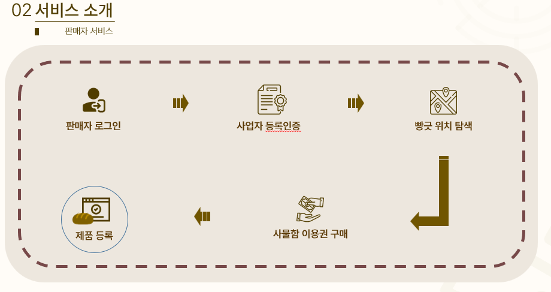

판매자는 로그인 후 사업자 인증 → 본인이 판매하고 싶은 빵 자판기의 칸을 티켓을 활용해 구매한 뒤 제품을 등록

 

  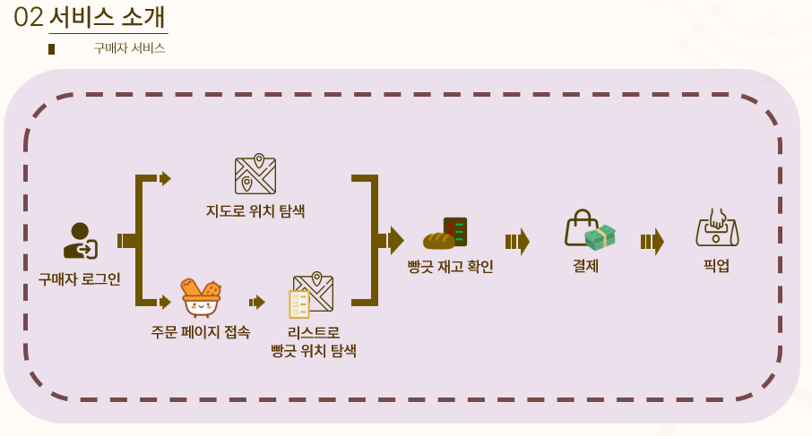

이후 구매자는 메인 페이지에 들어와 빵긋 자판기를 찾아 원하는 물건을 찾으면 결제를 한 뒤 직접 픽업

### 1‑3. 기대 효과

1. **마감 할인을 활용하여 가게에 남지 않고 빠른 퇴근 가능**
   - 인건비 절감 및 근무 피로도 감소
2. **폐기 예정 빵으로 추가 수익 창출**
   - 재고 빵 처리비용 감소 및 환경오염 절감효과
3. **매장 관리 효율성 향상 및 지속가능성 향상**

---

## 2. 주요 기능

### 2‑1. AI 기반 빵 객체인식

- **Yolo v8** 모델을 활용한 **빵 객체인식**
- 카테고리에 맞는 종류 분류, 유제품이 들어간 **상할 우려가 있는 빵** 등록방지

### 2‑2. NFT 기반 데이터 관리

- 타 매장에서의 사진 도용을 방지한 **NFT기반** 사진 데이터 관리
- 현재는 편의상 NFT기반 환경이 아닌 S3에서 데이터를 불러오게끔 구현

### 2‑3. 구매자(Mobile), 판매자(Web) 분리형 서비스

- I AM PORT를 활용한 실 사용 유사 결제 플로우 구현
- 서비스 분리로 인한 **한눈에** 직관적으로 구분 가능한 UI

---

## 3. 화면 구성

#### Web

| 메인                                             | 상품칸 목록                                            | 상품등록                                       |
| ------------------------------------------------ | ------------------------------------------------------ | ---------------------------------------------- |
| 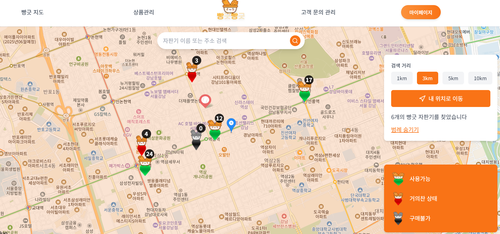 | 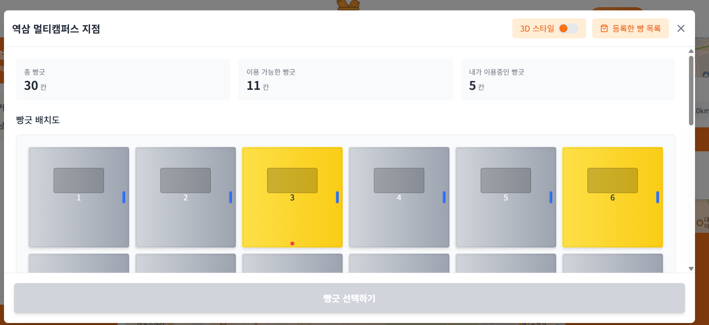 | 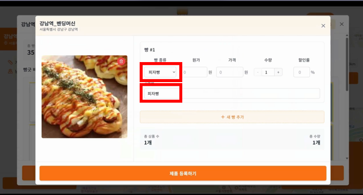 |

| 객체인식                                         | 사업자등록                                       | NFT                                             |
| ------------------------------------------------ | ------------------------------------------------ | ----------------------------------------------- |
| 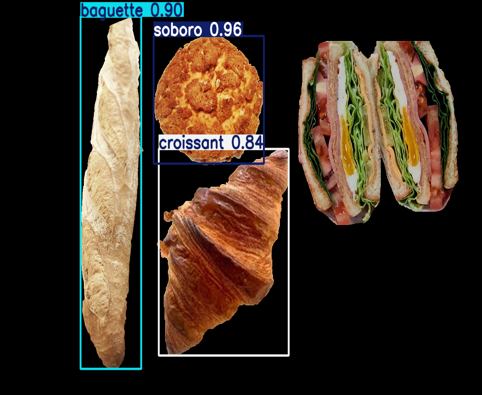 | 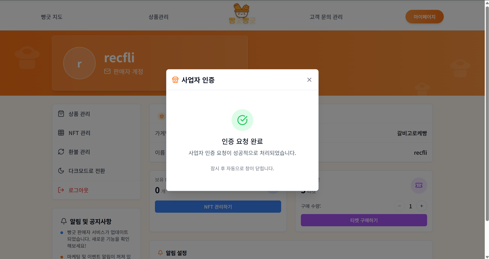 | 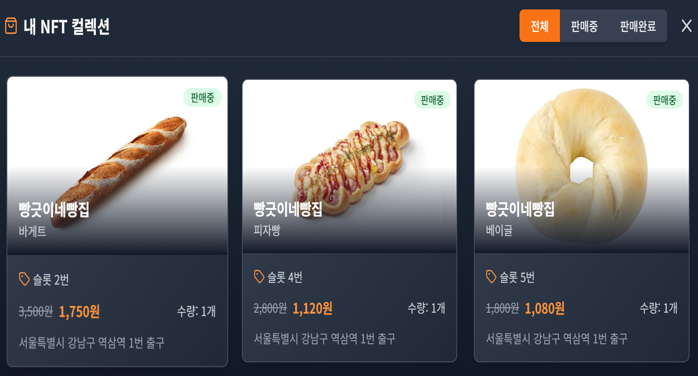 |

#### Mobile

| 홈                                               | 선택                                               | 픽업                                               |     |
| ------------------------------------------------ | -------------------------------------------------- | -------------------------------------------------- | --- |
| 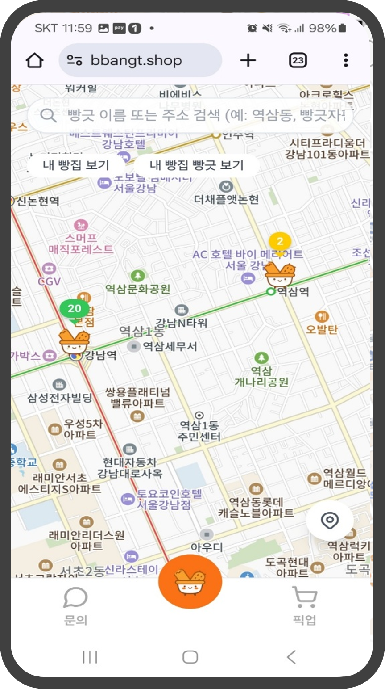 | 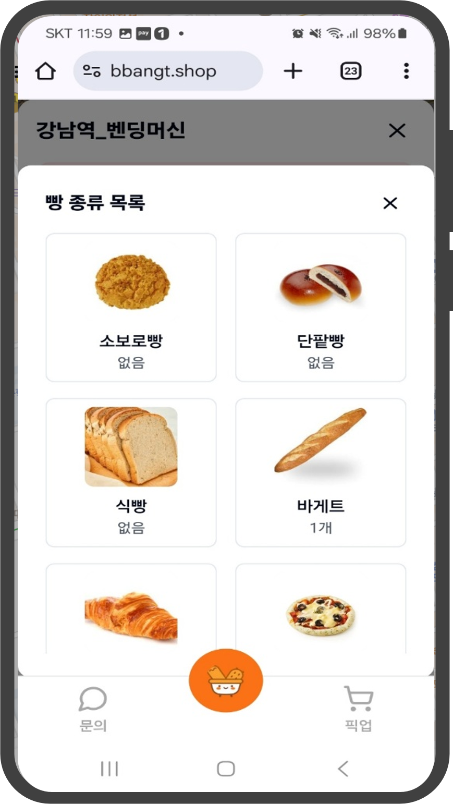 | 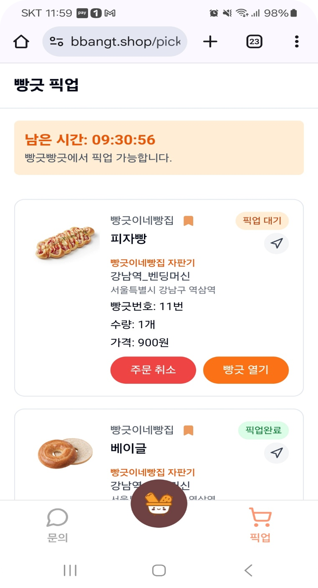 |

---

## 4. 팀 구성 및 역할

| 이름       | 포지션                   | 담당 업무                                                                                                          |
| ---------- | ------------------------ | ------------------------------------------------------------------------------------------------------------------ |
| **백명규** | Team Leader · Backend/AI | FastAPI 설계, 알고리즘 트레이딩 핵심 로직, Yolo v8 모델 학습                                                       |
| 송경민     | Frontend                 | PWA 앱, FCM 이용한 실시간 알림 기능                                                                                |
| 김정우     | Frontend                 | 주문/체결, API 연동, 사업자 인증·인가, REST·WebSocket, 오류 방지용 커스텀 훅, Zustand 상태 관리, 블록체인 지갑기능 |
| 문진수     | Backend, Infra           | Docker, AWS EC2 배포, Jenkins CI/CD, Nginx Proxy, 인증/인가, 랭킹 시스템, Redis Cache, 커뮤니티                    |
| 김수현     | Backend                  | 블록체인(NFT) 기반 분산데이터 저장 관리, 데이터 메모이제이션                                                       |

---
